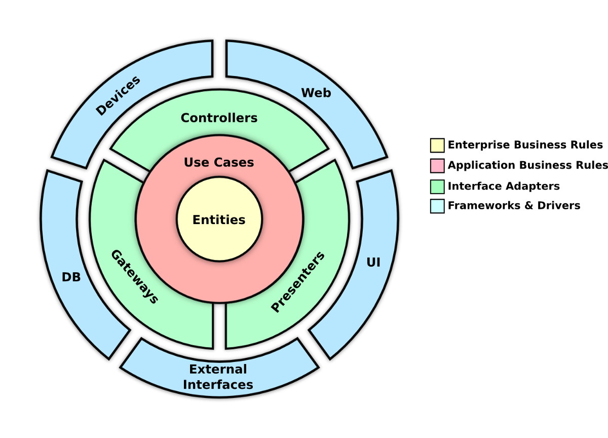
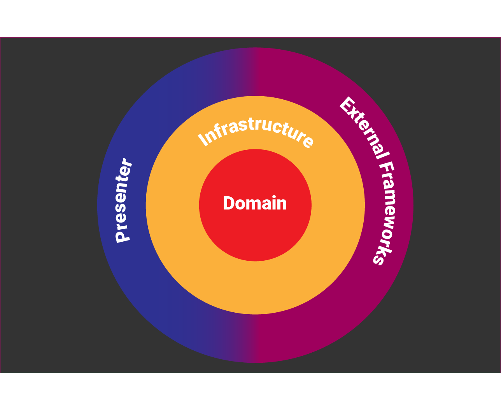

## MovieApp

### About:

Application that will consume The Movie Database (TMDb) where you can view upcoming movies and search for movies by text.

### Clean Architecture:

**Robert C. Martin** states that, to be considered "clean", an architecture must have at least 4 main and independent layers. They are:

1. Enterprise Business Rules
2. Application Business Rules
3. Interface Adapters
4. Frameworks & Drivers (External)

### Clean Dart

By using Flutter as an example, we have four layers, keeping the "plugin architecture", with the main focus on the Application Domain. In this layer inhabits the two main business rules, the **entities** and the **usecases**.

### Packages used:

#### [Dio:](https://pub.dev/packages/dio)
> A powerful Http client for Dart, which supports Interceptors, Global configuration, FormData, Request Cancellation, File downloading, Timeout etc.

#### [RxDart:](https://pub.dev/packages/rxdart)
> RxDart is a reactive functional programming library for Google Dart, based on ReactiveX.

#### [GetIt:](https://pub.dev/packages/get_it)
> This is a simple Service Locator for Dart and Flutter projects with some additional goodies highly inspired by Splat. It can be used instead of InheritedWidget or Provider to access objects e.g. from your UI.

#### [transparent_image:](https://pub.dev/packages/transparent_image)
> A simple transparent image. Represented as a Uint8List, which was originally extracted from the Flutter codebase (was private in the test package).

### Build info:

With the flutter already installed, clone the repository and open it with your favorite code editor, run the pub get in the pubspec.yaml file and wait until the build finishes

Flutter version used: v1.17.5

### Comments:

1. I made an infinite list where upon reaching 70% of the list, a new request is made to upload new films

2. It would not be so cool to put the genre of the film in the initial listing because the endpoint just returned the genre id, I would have to make a new request to get the details of each film, so I left the genre of the film only on the details screen

3. I used the concept of BLoC in state management, using StreamBuilders and Streams (RxDart) to update the view reactively (fire effects).
### Screenshots:

